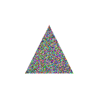

# EPL607 - Assignment: Part 1

In this project, I used a simple rasterize process to draw a triangle on an Image. 

## Description

I used 2 important functions to complete this assignment (further commends in code):
- rasterize_triangle
  - This function iterates over the image using a double for-loop and fill pixels that are inside the triangle.
  - In the class, we also learned some optimization approaches, to not iterate through all the image but using a bounding box for the triangle region, we can check far less pixels to draw. This is approach is far better in terms of performance. However, for the purpose of this exercise I iterated through the whole image and checked every pixel.
- is_inside_triangle
  - This function is the most important function for this assignment (checks which pixels to draw basically) here is the explanation:
  - With this function I check if a given point (px, py) is inside the triangle.
  - every triangle has 3 edges (lines connecting its 3 points)
  - A point can either be on one side of the edge, on the other size of the edge or exactly on the edge
  - we basically determine which side the point is on using the sign function in the code (inside the function)
  - A point inside the triangle must be on the same side for all three edges
  - If it is on a different side for at least one edge, then it is outside the triangle
  - for each of the edges, we calculate the sign of the point using the formula:
  - (x1 - x3) * (y2 - y3) - (x2 - x3) * (y1 - y3) # (V1-V2, V2-V3, V3-V1)
  - where x1, y1 represents the point, and the (x2, y2) and (x3, y3) represents the checked edge
  - So basically, each edge divides the space into 2 sides, if a point is on the same side for all three edges, its inside the triangle, if a point is on different sides of the edges, its outside.
  - So, If the point is on the same side of all three edges it is inside, if the point is on different sides is outside.
  - This function check this, by calculating the position of a point to a line.
  - A positive or negative result tell us which side the point is on according to an edge.
  - If the point has 3 similar signs for the 3 edges (3 positive or 3 negative) then it is inside, otherwise it is outside.
  - To be exact, if the result is:
  - Positive, the point is on one side of the line
  - Negative, the point is on the other side
  - zero, the point is EXACTLY on the line, in this case, I count that it is positive
  - The function returns true if the point has all signs the same thus the point is inside, and false, if the point is outside, since it has different signs relative to the edges.

### Dependencies
* I used python version: 3.9
* Also these libraries
```
from PIL import Image, ImageDraw
```
### Installing
* I used PIL as the Image Processing Library
```
pip install pillow
```
### Executing program

* You can chance in code the width, height of the image. (I used 200, 200 as default)
```
width, height = 200, 200
```
* You can also choose the points of the triangle (I used these p1, p2, p3 = (50, 150), (150, 150), (100, 50) as default)
```
p1, p2, p3 = (50, 150), (150, 150), (100, 50)
```
* Finally, you can choose the color of the triangle (color = (0, 0, 255) as default I use blue)
```
color = (0, 0, 255)
```
* Using a simple addition in code, we can color each pixel a differnt color if we want to
  ```
    for x in range(0, image.width + 1):
        for y in range(0, image.height + 1):
            if is_inside_triangle(x, y, v1, v2, v3):
                draw.point((x, y), fill=color)
  ```
* Specifically, in the rasterize_triangle function, instead of using a single color for all pixels inside triangle, we can add multiple colors by changing the fill attribute color for each iteration to any color we want in an RGB manner (R, G, B). An option can be to add a randomizer for each R-G-B value, for example use this line insted for drawing each pixel:
```
draw.point((x, y), fill=(random.randint(0, 255),random.randint(0, 255),random.randint(0, 255))
```
* This way each pixel in triangle can have a random color each time.
  
### Output example, using the defaults inputs shown above:


## Author

* Name: Panteleimonas Chatzimiltis
* Email: pchatz06@ucy.ac.cy
