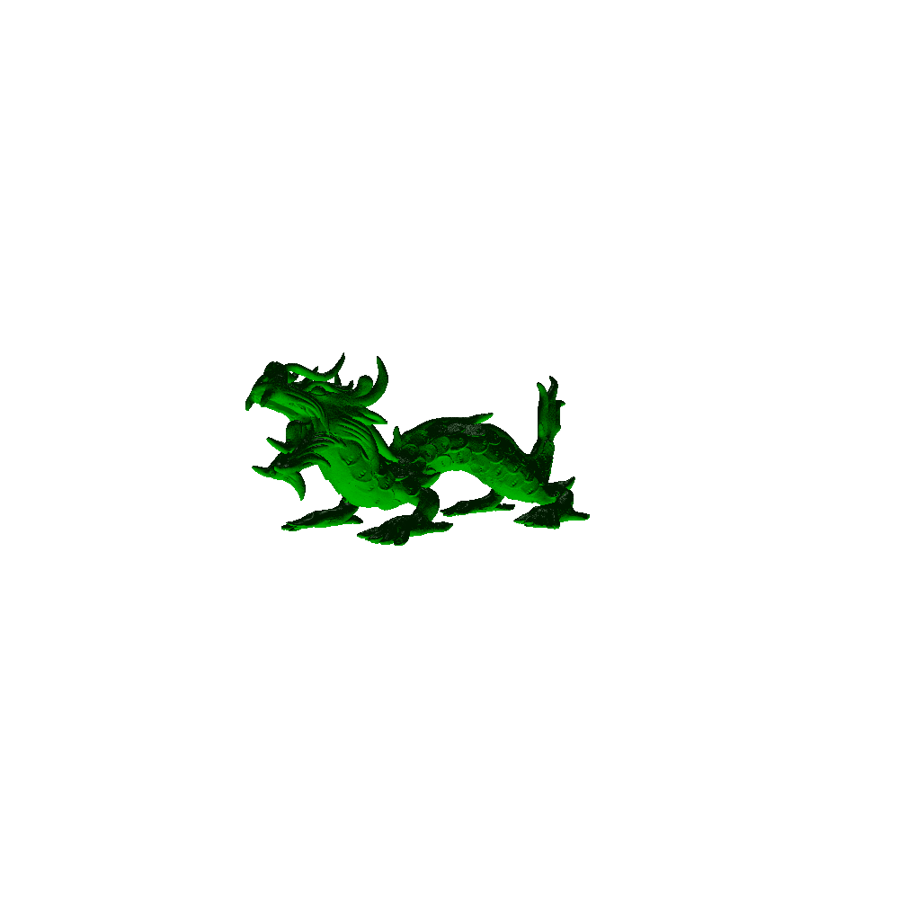
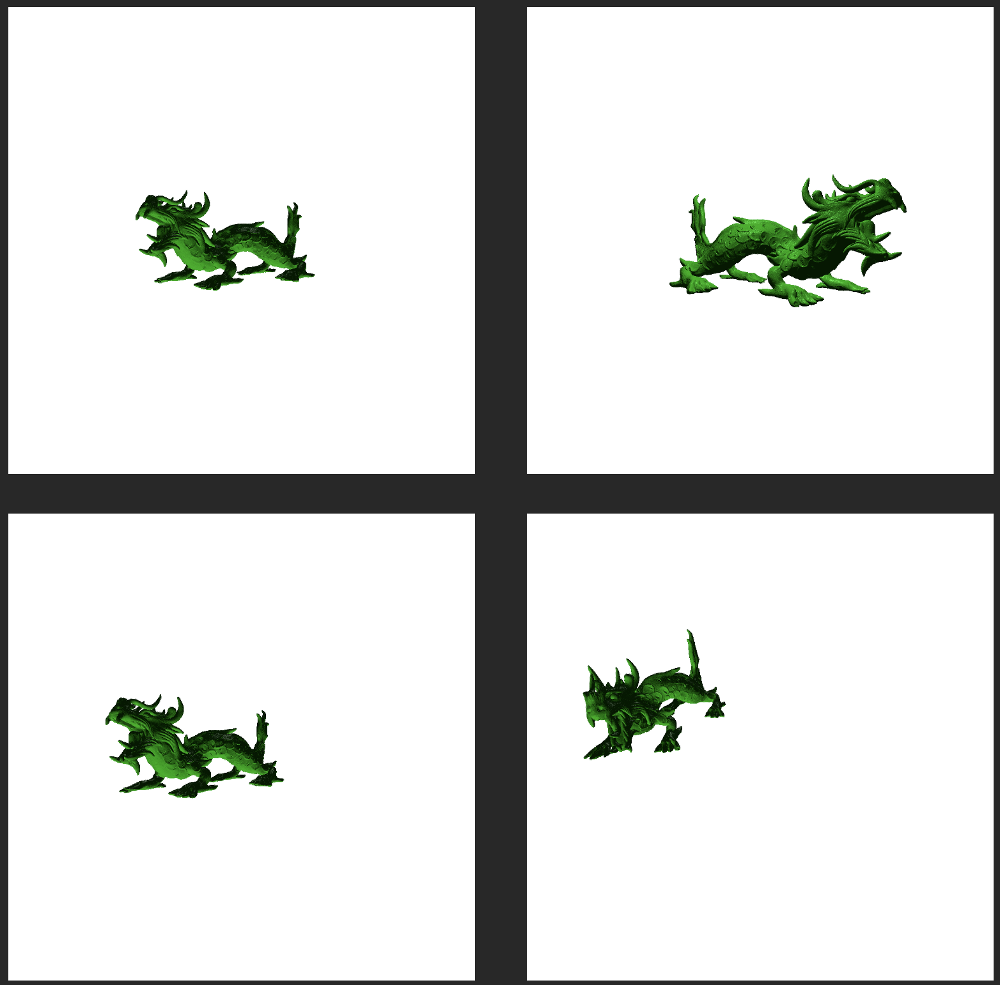

## Author

* Name: Panteleimonas Chatzimiltis
* Email: pchatz06@ucy.ac.cy

# EPL607 - Assignment: Part 1


In this project, I used Python to render a triangle on an image using a simple rasterization process.

## Description

I used 2 important functions to complete this assignment (further commends in code):
- rasterize_triangle
  - This function iterates over the image using a double for-loop and fill pixels that are inside the triangle.
  - In the class, we also learned some optimization approaches, to not iterate through all the image but using a bounding box for the triangle region, we can check far less pixels to draw. This is approach is far better in terms of performance. However, for the purpose of this exercise I iterated through the whole image and checked every pixel.
- is_inside_triangle
  - This function is the most important function for this assignment (checks which pixels to draw basically) here is the explanation:
  - With this function I check if a given point (px, py) is inside the triangle.
  - every triangle has 3 edges (lines connecting its 3 points)
  - A point can either be on one side of the edge, on the other size of the edge or exactly on the edge
  - we basically determine which side the point is on using the sign function in the code (inside the function)
  - A point inside the triangle must be on the same side for all three edges
  - If it is on a different side for at least one edge, then it is outside the triangle
  - for each of the edges, we calculate the sign of the point using the formula:
  - (x1 - x3) * (y2 - y3) - (x2 - x3) * (y1 - y3) # (V1-V2, V2-V3, V3-V1)
  - where x1, y1 represents the point, and the (x2, y2) and (x3, y3) represents the checked edge
  - So basically, each edge divides the space into 2 sides, if a point is on the same side for all three edges, its inside the triangle, if a point is on different sides of the edges, its outside.
  - So, If the point is on the same side of all three edges it is inside, if the point is on different sides is outside.
  - This function check this, by calculating the position of a point to a line.
  - A positive or negative result tell us which side the point is on according to an edge.
  - If the point has 3 similar signs for the 3 edges (3 positive or 3 negative) then it is inside, otherwise it is outside.
  - To be exact, if the result is:
  - Positive, the point is on one side of the line
  - Negative, the point is on the other side
  - zero, the point is EXACTLY on the line, in this case, I count that it is positive
  - The function returns true if the point has all signs the same thus the point is inside, and false, if the point is outside, since it has different signs relative to the edges.

### Dependencies
* I used python version: 3.9
* Also these libraries
```
from PIL import Image, ImageDraw
import random
```
### Installing
* I used PIL as the Image Processing Library
```
pip install pillow
```
### Executing program

* You can chance in code the width, height of the image. (I used 200, 200 as default)
```
width, height = 200, 200
```
* You can also choose the points of the triangle (I used these p1, p2, p3 = (50, 150), (150, 150), (100, 50) as default)
```
p1, p2, p3 = (50, 150), (150, 150), (100, 50)
```
* Finally, you can choose the color of the triangle (color = (0, 0, 255) as default I use blue)
```
color = (0, 0, 255)
```
* Using a simple addition in code, we can color each pixel a differnt color if we want to
  ```
    for x in range(0, image.width + 1):
        for y in range(0, image.height + 1):
            if is_inside_triangle(x, y, v1, v2, v3):
                draw.point((x, y), fill=color)
  ```
* Specifically, in the rasterize_triangle function, instead of using a single color for all pixels inside triangle, we can add multiple colors by changing the fill attribute color for each iteration to any color we want in an RGB manner (R, G, B). An option can be to add a randomizer for each R-G-B value, for example use this line insted for drawing each pixel:
```
draw.point((x, y), fill=(random.randint(0, 255),random.randint(0, 255),random.randint(0, 255))
```
* This way each pixel in triangle can have a random color each time.
  
### Output example, using the defaults inputs shown above:
* One color triangle (Blue): \


* Random color per pixel triangle: \


# EPL607 - Assignment: Part 2
In this project, I implemented perspective projection and rasterization.

## Description
* Definition of a vertice (introduction on z):
```
# (x, y, z)
vertices = [
    (-50, -50, 1),  
    (50, -50, 1),
    (50, 50, 1)
]
```
* Definition of triangle:
```
# The definition of the triangle is like so [vector 1, vector 2, vector 3, color RGB])
triangles = [
    [vertices[0], vertices[1], vertices[2], (255, 0, 0)],
    [vertices[0], vertices[1], vertices[2], (0, 255, 0)]
]
```
* Rasterization after the addition of z
```
# Rasterize triangles by deviding their x and y by z, and also, move the (0,0) to the center of the picture using width/2 for x and height / 2 for y like shown below.
for t in triangles:
    p1, p2, p3 = (
        (t[0][0] / t[0][2] + width / 2, height / 2 - t[0][1] / t[0][2], t[0][2]),
        (t[1][0] / t[1][2] + width / 2, height / 2 - t[1][1] / t[1][2], t[1][2]),
        (t[2][0] / t[2][2] + width / 2, height / 2 - t[2][1] / t[2][2], t[2][2])
    )
    color = t[3]
    rasterize_triangle(image, zbuffer, p1, p2, p3, color)
```
* Addition of a new function (compute_plane). Here I calculate the equation of the plane with 3 points.
the three points of vectors (v1, v2, v3) define a plane, and the output is the plane equation in the form: Ax + By + Cz + D = 0 where (A, B, C) is the normal vector and D is a constant. The reason I do this, is to solve to find z for each pixel in order to identify what triangle has the lowest z to be drawn by its color.

```
def compute_plane(v1, v2, v3):
    #vectors
    x1, y1, z1 = v1
    x2, y2, z2 = v2
    x3, y3, z3 = v3

    u = (x2 - x1, y2 - y1, z2 - z1)
    v = (x3 - x1, y3 - y1, z3 - z1)

    # Cross product to find normal vector (A, B, C)
    A = u[1] * v[2] - u[2] * v[1]
    B = u[2] * v[0] - u[0] * v[2]
    C = u[0] * v[1] - u[1] * v[0]
    D = -(A * x1 + B * y1 + C * z1)

    return A, B, C, D
```

* Modifications of the rasterize_triangle function:
```
# I compute plane's A, B, C, D in order to find z later on
A, B, C, D = compute_plane(v1, v2, v3)

# bounding box calculation, really simple approach (added the image bound (heigh, width) in the calculations for further performance).
min_x = round(max(min(v1[0], v2[0], v3[0]), 0))
max_x = round(min(max(v1[0], v2[0], v3[0]), image.width - 1))
min_y = round(max(min(v1[1], v2[1], v3[1]), 0))
max_y = round(min(max(v1[1], v2[1], v3[1]), image.height - 1))

# Inside the nested for-loop which will go pass from the pixel of the triangle, I added the following:
# Calculate z from plane: z = -(Ax + By + D) / C
# And if the z has lower value that the zbuffer then a triangle closer to the previous should drawn the pixel, and update the closes z-value for the pixel on the zbuffer.
z = -(A * x + B * y + D) / C
if z < zbuffer[x][y]:
    zbuffer[x][y] = z
    draw.point((x, y), fill=color)

```

### Executing the improved program
* The first experiment, was to try and create a cube using the following vertices and triangles:
```
vertices = [
    (-50, -50, 1),  # Front-bottom-left
    (50, -50, 1),  # Front-bottom-right
    (50, 50, 1),  # Front-top-right
    (-50, 50, 1),  # Front-top-left
    (-50, -50, 2),  # Back-bottom-left
    (150, -50, 2),  # Back-bottom-right
    (150, 150, 2),  # Back-top-right
    (-50, 150, 2)  # Back-top-left
]
triangles = [
    [vertices[0], vertices[1], vertices[2], (255, 0, 0)],  # Red triangle
    [vertices[0], vertices[2], vertices[3], (255, 0, 0)],  # Red triangle
    [vertices[4], vertices[5], vertices[6], (0, 255, 0)],  # Green triangle
    [vertices[4], vertices[6], vertices[7], (0, 255, 0)],  # Green triangle
    [vertices[0], vertices[3], vertices[7], (0, 0, 255)],  # Blue triangle
    [vertices[0], vertices[7], vertices[4], (0, 0, 255)],  # Blue triangle
    [vertices[1], vertices[2], vertices[6], (255, 255, 0)],  # Yellow triangle
    [vertices[1], vertices[6], vertices[5], (255, 255, 0)],  # Yellow triangle
    [vertices[2], vertices[3], vertices[7], (255, 165, 0)],  # Orange triangle
    [vertices[2], vertices[7], vertices[6], (255, 165, 0)],  # Orange triangle
    [vertices[0], vertices[1], vertices[5], (255, 255, 255)],  # White triangle
    [vertices[0], vertices[5], vertices[4], (255, 255, 255)],  # White triangle
]
```

* The output is like so:


* I also tried to run some other triangle experiments to test, the z addition, from which this is a simple z experiment where the blue is the closest to the camera, next is the green and furthest is the red:
```
triangles = [
    [(-120, -120, 2), (120, -120, 2), (0, 120, 2), (255, 0, 0)],  # Red (closest)
    [(-75, -75, 1.5), (75, -75, 1.5), (0, 75, 1.5), (0, 255, 0)],  # Green
    [(-40, -40, 1), (40, -40, 1), (0, 40, 1), (0, 0, 255)],  # Blue (farthest)
]
```


* Finally, I wanted to test something extreme, from where the triangles, will pass one trhough another, by just modifying the z of the top point:
```
triangles = [
    [(-120, -120, 2), (120, -120, 2), (0, 120, 2), (255, 0, 0)],  # Red (closest)
    [(-75, -75, 1.5), (75, -75, 1.5), (-100, 150, 3), (0, 255, 0)],  # Green
    [(-40, -40, 1), (40, -40, 1), (100, 90, 2.5), (0, 0, 255)],  # Blue (farthest)
]
```

  
# EPL607 - Assignment: Final Part
In this project, I implemented Load 3D Geometry, Shading, Animation and Camera extensions.

## Load 3D Geometry
- I have downloaded 3D objects from [https://graphics.stanford.edu/data/3Dscanrep/](https://graphics.stanford.edu/data/3Dscanrep/).
- After doing so, since the format was not .obj, I used Blender software, to export the object in .obj format.
- I used PyWavefront as the library to load these files.
- To get the triangles from the object I used the code below (it has some additional features, that we will talk about later).
```
# Load the 3D object (requiring a .obj and a .mtl file)
scene = pywavefront.Wavefront('dragon/Untitled.obj', collect_faces=True)

# Load the triangles from object
material = Material(color=(0, 1, 0), ambient=0.1, diffuse=0.6, specular=0.3, shininess=32)
triangles = load_triangles_from_obj(scene, width, height, camera_lookat, material)

def load_triangles_from_obj(scene, width, height, camera, material):
    triangles = []
    vertices = scene.vertices

    for mesh in scene.mesh_list:
        for face in mesh.faces:
            if len(face) != 3:
                continue

            v1 = camera.world_to_camera(vertices[face[0]])
            v2 = camera.world_to_camera(vertices[face[1]])
            v3 = camera.world_to_camera(vertices[face[2]])

            # Skip triangles behind the camera
            if v1[2] <= 0 or v2[2] <= 0 or v3[2] <= 0:
                continue

            p1 = project(v1, width, height, camera.fov)
            p2 = project(v2, width, height, camera.fov)
            p3 = project(v3, width, height, camera.fov)

            normal = np.cross(np.subtract(v2, v1), np.subtract(v3, v1))
            view_dir = normalize(-v1)

            # Use transformed light for shading
            color = phong_shading(v1, normal, view_dir, material, light_world)
            triangles.append((p1, p2, p3, color))

    return triangles
```
* An example render of a 3D object that I downloaded and loaded is this (A dragon -- WOW):


## Shading
- I implemented a local illumination for my renderer.
- The code supports both diffuse and specular materials.
- I implemented a material class, so it will be easy to apply materials to 3D objects and to reuse them:
```
class Material:
    def __init__(self, color, ambient=0.1, diffuse=0.7, specular=0.2,
                 shininess=32):  # DEFAULT VALUES ambient + diffuse + specular must be 1 ideally...
        self.color = color  # Base RGB color
        self.ambient = ambient
        self.diffuse = diffuse
        self.specular = specular
        self.shininess = shininess
```
- It is also easy to define light sources in the scenes with my design using a Light object:
```
class Light:
    def __init__(self, position, intensity=(1, 1, 1)): # DEFAULT VALUE
        self.position = position
        self.intensity = intensity  # RGB tuple

light_world = Light(position=(0, 0, 10), intensity=(1.0, 1.0, 1.0))

```
- Below is the code for shading using phong:
```
def phong_shading(point, normal, view_dir, material, light):
    normal = normalize(normal)
    light_dir = normalize(np.array(light.position) - np.array(point))
    reflect_dir = normalize(2 * normal * np.dot(normal, light_dir) - light_dir)

    ambient = np.array(material.color) * material.ambient

    diff = max(np.dot(normal, light_dir), 0.0)
    diffuse = np.array(material.color) * material.diffuse * diff


    spec = max(np.dot(view_dir, reflect_dir), 0.0) ** material.shininess
    specular = np.array(light.intensity) * material.specular * spec

    color = ambient + diffuse + specular
    color = np.clip(color, 0, 1) * 255

    return tuple(color.astype(int))
```

## Animation
- I use the code, below to create the translation, rotation and scaling:
```
def transform_scene(scene, matrix):
    scene.vertices = apply_transformations(scene.vertices, matrix)


def apply_transformations(vertices, matrix):
    transformed = []
    for v in vertices:
        v_homogeneous = np.array([v[0], v[1], v[2], 1])  # A 3D point extended to 4D to allow translations
        v_transformed = matrix @ v_homogeneous  # Matrix multiplication
        transformed.append(v_transformed[:3])
    return transformed


def translation_matrix(tx, ty, tz):
    return np.array([
        [1, 0, 0, tx],
        [0, 1, 0, ty],
        [0, 0, 1, tz],
        [0, 0, 0, 1]
    ])


def scaling_matrix(sx, sy, sz):
    return np.array([
        [sx, 0, 0, 0],
        [0, sy, 0, 0],
        [0, 0, sz, 0],
        [0, 0, 0, 1]
    ])


def rotation_matrix_x(theta):
    c, s = np.cos(theta), np.sin(theta)
    return np.array([
        [1, 0, 0, 0],
        [0, c, -s, 0],
        [0, s, c, 0],
        [0, 0, 0, 1]
    ])


def rotation_matrix_y(theta):
    c, s = np.cos(theta), np.sin(theta)
    return np.array([
        [c, 0, s, 0],
        [0, 1, 0, 0],
        [-s, 0, c, 0],
        [0, 0, 0, 1]
    ])


def rotation_matrix_z(theta):
    c, s = np.cos(theta), np.sin(theta)
    return np.array([
        [c, -s, 0, 0],
        [s, c, 0, 0],
        [0, 0, 1, 0],
        [0, 0, 0, 1]
    ])
```
- To create a video of a cube, that is using translation, rotation (x, y, z) and scaling I used the following code:
```
width, height = 1000, 1000
frames = 60

for i in range(frames):
    t = i / frames

    # Rotation angles in degrees
    angle_x = 30 * np.sin(2 * np.pi * t)
    angle_y = 360 * t
    angle_z = 20 * np.cos(2 * np.pi * t)

    # Translation and scale oscillation
    tx = 0.5 * np.sin(2 * np.pi * t)
    ty = 0.2 * np.cos(2 * np.pi * t)
    scale = 1 + 0.1 * np.sin(2 * np.pi * t)

    # Build transformations
    Rx = rotation_matrix_x(angle_x)
    Ry = rotation_matrix_y(angle_y)
    Rz = rotation_matrix_z(angle_z)
    T = translation_matrix(tx, ty, 0)
    S = scaling_matrix(scale, scale, scale)

    # Combined transformation: T * Rz * Ry * Rx * S
    transformation = T @ Rz @ Ry @ Rx @ S

    # Apply to fresh scene
    scene_frame = pywavefront.Wavefront('box/box.obj', collect_faces=True)
    scene_frame.vertices = copy.deepcopy(original_vertices)
    transform_scene(scene_frame, transformation)

    # Render frame
    image = Image.new("RGB", (width, height), (255, 255, 255))
    zbuffer = [[float('inf')] * width for _ in range(height)]

    triangles = load_triangles_from_obj(scene_frame, width, height, camera)

    for t in triangles:
        p1, p2, p3 = t[0], t[1], t[2]
        color = t[3]
        rasterize_triangle(image, zbuffer, p1, p2, p3, color)

    image.save(f"frames/frame_{i:03d}.png")
```
- After saving the images, I created the video using the following bash command:
```
ffmpeg -framerate 3 -i frames/frame_%03d.png -c:v libx264 -pix_fmt yuv420p -y output.mp4
```
* Here is the resulted video:
[Watch the rotating box video](https://github.com/pchatz06/EPL607_Assignment_pchatz06/raw/refs/heads/main/output.mp4)


## Camera
- I also implemented a camera system, where lets you render scene from various positions, a user can modify the camera position, orientation (look-at vector), up vector and Field of view.
- Here is the definition of the object for the camera:
```
class Camera:
    def __init__(self, position, look_at, up, fov):
        self.position = np.array(position)
        self.look_at = np.array(look_at)
        self.up = np.array(up)
        self.fov = fov

    def world_to_camera(self, point):
        # Create coordinate system
        forward = normalize(self.look_at - self.position)
        right = normalize(np.cross(forward, self.up))
        up = np.cross(right, forward)

        # Transform point to camera space
        rel = np.array(point) - self.position
        x = np.dot(rel, right)
        y = np.dot(rel, up)
        z = np.dot(rel, forward)
        return np.array([x, y, z])
```
- This code includes the world-to-camera function, which basically returns the position of an object based on the camera position (WC to VC).
- Here is an example of camera definition:
```
camera = Camera(
    position=(0, 5, 5),        
    look_at=(0, 0, 1),         
    up=[0, 1, 0],             
    fov=90
)
```
- The camera is used when we load the triangles from object in the function showed above.
- Here are different image results when rendering the dragon, with different parameters used for camera:

